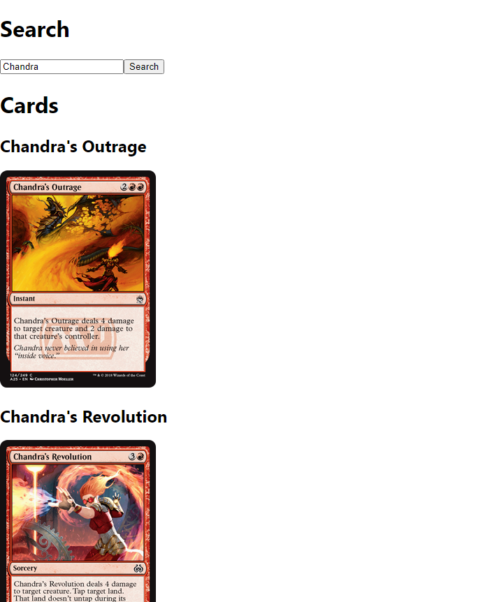

# Card Search

 ## Table of Contents  
[About](#About)  
[Installation](#Installation)  
[Usage](#Usage)  
[Deployment](#Deployment)   
[Preview](#Preview)   
[Issues](#Issues)  
[Future Development](#Future-Development)  
[Contact Me](#Contact-Me)  

## About  

The idea behind this app is to create a simple interface using React hooks (useState, useEffect) to search through the catalog of Magic the Gathering trading cards provided by the [magicthegathering.io](https://docs.magicthegathering.io/) API. 

The App allows the user to enter a search term and submit. The app will take this submitted term and update the displayed cards to cards that match the term.

## Installation  

To install this app, clone the repo to local, open the project folder to /search and run "npm start" in the terminal. The app should now be running on [localhost:3000](http://localhost:3000/).

## Usage  

This app works like any search bar you have encountered, simply type the name of your favorite magic the gathering card into the search field and hit the search button. The page will load all cards that match the search term.

## Deployment  

Currently this project is not yet deployed. 

At the moment it is very bare-bones, no styling, working on functionality.

## Issues  

I mainly did this project to improve with React and React Hooks, mainly practicing using useState and useEffect. I initially had some problems with when to use useEffect and had an issue as I initially put the search api call into a new useEffect() instead of handleFormSubmit() which I think ended up causing a loop. Besides this I didnt have much trouble.
 

## Preview

## Future Development

### Short term
My immediate ideas for this simple app includes adding filter options to the search via a checkbox or drop down, ie searching by color, mana cost, type, set and legality and having the displayed cards update live on selecting a filter. And of course styling, since right now I only prioritized functionality, I eventually want to add a much more visually appealing interface.

### Long Term
Currently my long term plan for this project is to integrate it into a larger, more feature heavy project. 

## Contact Me

Feel free to Contact me with any questions or check me out via these links:  
[My Github](https://github.com/apemint)    
[LinkedIn](linkedin.com/in/andres-a-escobar)  
[Twitter](https://twitter.com/apemint)  

Or email me:
escobar.andres.alfonso@gmail.com